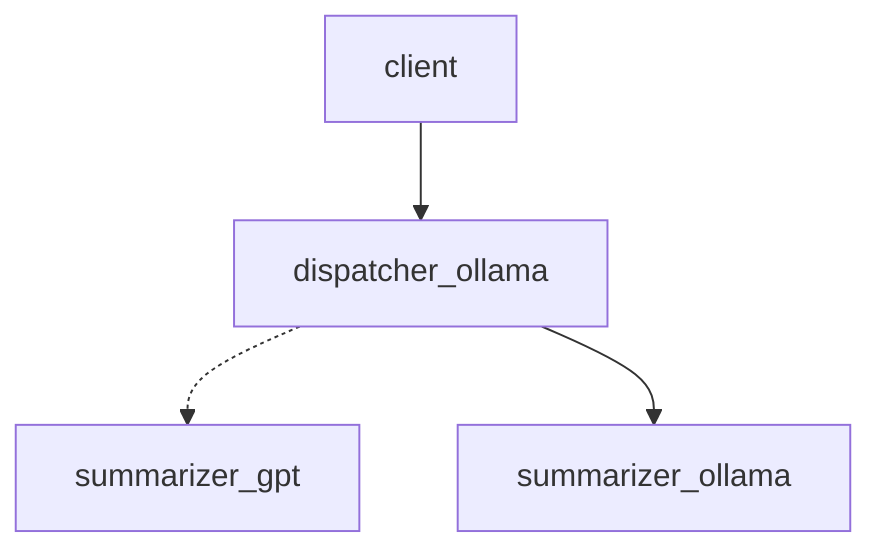

# Dispatcher example

## Overview

This a simple example of how to use Fabric to create a multi-agents architecture. The scenario is as follow:

- The fabric include 3 agents:
  - a GPT agent with a summarizer capability and a high cost
  - an Ollama agent with a summarizer capability and a low cost
  - an Ollama agent with a dispatching capability 
- A client submit a task
- The task is automatically sent to a dispatcher
- The dispatcher will select the appropriate task using a predefined strategy 
(in this case a capable agent with lower cost)
- The task is forwarded to the Ollama_summarizer agent and is executed
- The response is sent back to the client



## How to run

```bash
export OPENAI_TOKEN=<token>
docker compose up --build
```
